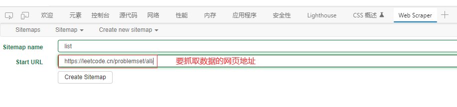
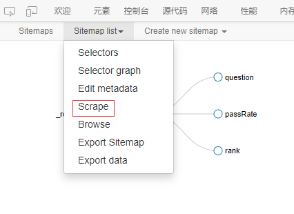

## Web Scraper 教程——抓取页面数据

### 一、简介

### 二、示例

本案例以抓取所有leetcode题目列表为例。

#### 2.1 创建一个sitemap

在网页中右键，选择【检查】，进入开发者模式，点击【Web Scraper】

选择【Create new sitemap】，【Start URL】是需要抓取数据的网站地址。

#### 2.2 创建选择器

这些选择器以类似树状结构的方式排列，这些选择器就是我们要爬取的数据。选择【add new selector】创建选择器。

【Type】对应的选择器类型，这里选择【Element】，选择【Select】手动选择要抓取的数据范围。

在**Element**选择器中继续创建新的选择器，这个选择器存放的是题目

继续在**Element**选择器中创建选择器，这个选择器存放的是通过率

与上面的步骤一样，在**Element**选择器中创建选择器，此选择器存放的是难度。Element选择器中有三个子选择器。

#### 2.3 数据预览

点击【data preview】可以预览数据，包括子选择器的数据和所有数据

#### 2.4 选择器图

打开【Selector graph】，可以看到选择器是怎样构建的

#### 2.5 抓取数据

点击【Scrape】就可以抓取数据了，下图就是我们抓取的数据了

#### 2.6 下载数据

点击【Export data】就可以导出数据了，可以选择`xlsx`类型或者`csv`类型

