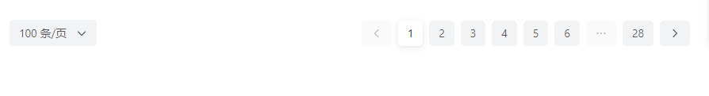
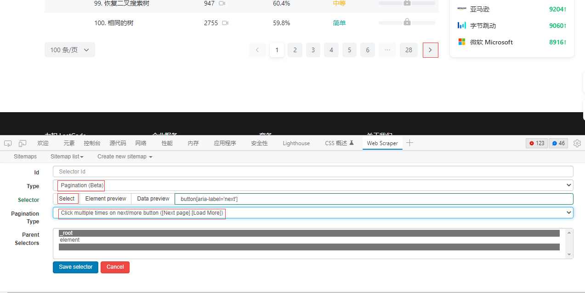
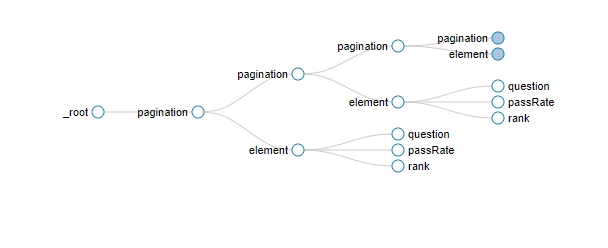
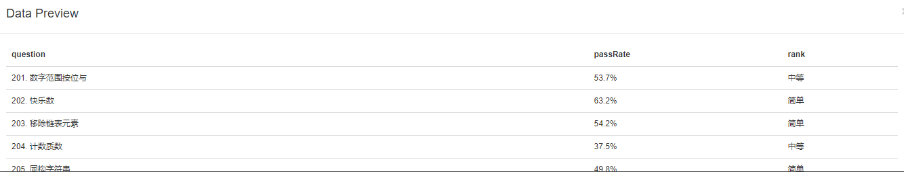
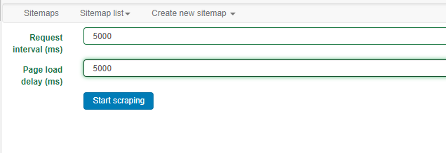

## Web Scraper 教程2

### 一、处理分页

像很多页面的数据是分多页的，抓取后面页面的数据，可以用pagination选择器

【Add new Selector】，Type选择Pagination，点击Select用鼠标选择下一页的button，pagination Type选择Load More，当然也可以选择另外的类型，但是需要选择对应的元素。

下面就是在pagination里面创建选择器，步骤同上一个教程一样。

创建完成之后，得到的sitemap graph如下图

预览数据看一下

选择【scraper】抓取数据，请求时间可以适当延长一点，如果在请求时间内页面还没加载出来，那么抓取器会默认所有页面已经抓取完了，就结束程序了。

