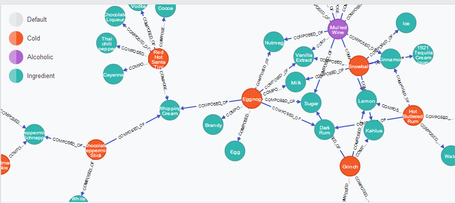

**知识图谱的定义**

一个数据图，用于存放和传递现实世界中的数据，结点代表实体，结点与结点之间的边代表实体之间的关系

**知识图谱的构建方法**

1. 自顶向下：借助百度百科等网站的结构化数据，从高质量数据中提取本体和模式信息，加入到知识库中
2. 自底向上：借助技术手段，从公开数据集中提取出资源模式，选择其中置信度较高的数据，加入到知识库中

**数据类型**

结构化数据、半结构化数据、非结构化数据

举个栗子，现在需要统计班级的返校信息

①学校给的样表，属性都是预先设定好的，那么结构化数据可表示为：

表1

| 姓名 | 家庭住址 | 是否暂缓返校 | 返校居住地址 |
| ---- | -------- | ------------ | ------------ |
| 张三 | 四川省   | 是           | 宿舍         |
| 李四 | 重庆市   | 否           | 宿舍         |
| 王五 | 上海市   | 是           | 宿舍         |

②半结构化数据

可能有的同学在封控区，这时需要存放同学的核酸记录，有的同学可能需要暂缓返校，需要存放返校时间，同学的信息大不相同，采用传统的关系型数据库不合适，这时我们构建半结构化格式

```json
{
	'姓名':'张三',
	'家庭住址':'四川省',
	'是否暂缓返校':'是',
	'返校居住地址':'宿舍',
	'所在地区风险等级':'高风险地区',
	'是否做核酸':'是',
    '返校时间':'9-25'
}
```

```json
{
	'姓名':'李四',
	'家庭住址':'重庆市',
	'是否暂缓返校':'否',
	'返校居住地址':'宿舍',
}
```

```json
{
	'姓名':'王五',
	'家庭住址':'上海市',
	'是否暂缓返校':'是',
	'返校居住地址':'宿舍',
	'所在地区风险等级':'低风险地区',
	'返校时间':'9-20'
}
```

③非结构化数据

有的同学可能暂时有事不能编辑表格，于是编辑了一段文字发个了同学，让同学帮忙填写表格

```txt
钱六云南省否宿舍
```

这既是非结构的数据，只是简单的文本，没有任何结构可言。

看一下具体的定义

1. 结构化数据：存储在数据库中，可以用二维表来逻辑表达实现的数据，机构化数据的数据存储和排列都是具有规律性的，对于增删改查等功能支持友好
2. 非结构化数据：没有固定模式的数据，如 WORD、PDF、PPT，各种格式的图片、视频等
3. 半结构化数据：非关系模型的，有基本固定结构模式的数据，例如日志文件、XML 文档、JSON 文档、Email 等

补充：Excel表格中存放的不一定是结构化数据，结构化数据可以用Excel表格存放，主要是看Excel中是否可以提取出结构化数据，如表1就是结构化数据，但如果是下图中的数据，就不是结构化数据了


**存储方式**

- RDF（资源描述框架）

 一种范式存储格式，比较常用的有Jena

```RDF
<RDF>
    <Description about="https://www.w3.org/RDF/">
        <DC:title>
             An introduction to the Resource Description Framework
        </DC:title>
        <DC:creator>
             clean2begin
        </DC:creator>
        <DC:date>
             2022-0911
        </DC:date>
    </Description>
</RDF>
```

- 图数据库

常用的有neo4j，如下图



**构建技术**

这里主要提到的技术是自底向上的

对半结构化数据和非结构化数据，主要用到的是NLP技术：

1. 实体抽取：命名实体识别（NER），从文本中自动识别出命名实体
2. 关系抽取：提取出实体之间的关系
3. 属性抽取：

**实验构建过程**

1. 导入包
2. spacy设置
3. 数据清洗
   - 删除特殊字符
   - 删除停止符和标点符号
   - 创建三元列表
   - 删除日期
   - 删除重复词
   - 创建三元组
4. 读取数据
5. 创建结点和边列表
6. 将结点和边列表组成元组列表
7. 将元组列表转为浮点数列表
8. 填充数据库
9. 实体消歧：通过计算两个结点的余弦相似度，判断两个结点是否是有相同的含义

**构建知识图谱的主要步骤**

1. 知识抽取
   - 从非结构化和半结构化的数据中通过NLP技术抽取出：实体—关系—属性

————————————————————————

**知识抽取**

1. 即是从不同来源、不同结构的数据中对知识进行提取，形成结构化数据，存入知识图谱中
2. 知识抽取包括的一些子任务
   - 命名实体识别
   - 术语抽取
   - 关系抽取
   - 事件抽取
   - 共指消解


**知识融合**

1. 将多个来源的关于同一个实体或概念的描述信息融合起来
2. 又名：本体对齐，实体对齐，本体匹配，Record Linkage，Entity Resolution

**知识表示**

1. 什么是知识表示

在认知科学领域，知识表示指的是人类如何存储和处理数据，在人工智能领域，指的是如何存储数据，让程序能够处理

2. 人工智能领域的知识表示方法

**知识存储**

**RDF**

1. 表示不同来源的数据之间的关系，比如一个网站包括另一个网站的链接
2. 组成：
   - 主语
   - 谓语
   - 宾语
3. 节点类型
   - URI
   - 字面量
   - 空节点


**SVO**

using NLP, so we use SVO


